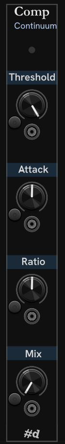

# Compress module

The EaganMatrix compressor is controlled using the Compress module.

The light at the top is lit according to the Compressor Mix.

The **Threshold**, **Attack**, **Ratio** and **Mix** knobs match the corresponding control in the Haken Editor.
Each parameter accepts absolute and relative control voltage the same way as the knobs on the main HC-1 module.

---

**Slug** `pachde-hc-compressor`

// Copyright © Paul Chase Dempsey\
