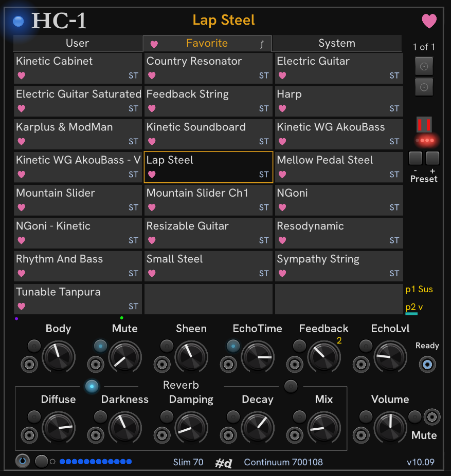

# Module HC-1

HC-1 is the core module for the pachde (#d) HC One plugin.
All other modules in the plugin are companions for HC-1, and don't do anything without HC-1 in the patch.

HC-1 supports the Haken Continuum and other Haken Audio Eagan Matrix-based devices like the Eagan Matrix Eurorack module (EMM) and the Osmose from Expressive E.
It is focused on having quick and easy access to presets on the device, favorites, plus CV control of the most essential performance settings, on a compact panel.

HC-1 is not a replacement for the Haken Editor.
The Haken Editor is still required for managing and editing user presets.

**Note** — This documentation uses the terms *Eagan Matrix*, *EM*, and *device* interchangeably.
They all refer to whatever Eagan-Matrix-based device you are controlling with HC-1.

HC-1 was designed for Eagan Matrix firmware version 10.09.
Earlier or later firmware versions may require changes to HC-1.
If you have an issue, please open one in the Github Issues or send me an email.

Here is the HC-1 module with it's companions HC-2 and [HC-3](HC-3.md).

While they're shown side-by-side as typical for Rack modules with expanders,
the HC One modules automatically find each other without having to sit next to each other.

When first loaded, there is a long initialization time to read all user and system presets from the device.
By default, the presets are cached, so the next time you open the patch, it should be up and running much faster.

You can watch the prograss of the multi-step initialization process with the row of dots on the bottom.
When everything is connected and working as expected, all the dots are blue, and you can begin playing.

> **Trouble-shooting:** Eagan Matrix devices require a high-quality MIDI connection.
The HC-1 initialization process can sometimes fail, especially when you have a poor MIDI connection.
When this happens, you may need to reboot HC-1 from the menu, unplug and re-plug the MIDI connection, or power cycle the device.
When possible, make sure you're using a connection directly to the computer, and not through a USB hub.
Even then, you may need to use a different USB port on your computer.
Be sure to use the MIDI cable that came with your device or another high-quality USB cable.

## A tour of the user interface

There's a lot packed into HC-1, so let's take a tour.

From right to left, top to bottom:

- Device status indicator light. This shows the same thing the status light in the Haken Editor does.

- Module title **HC-1**

- Current preset name in Gold.
  This space also carries status messages in gray while the module is initializing and processing actions on the device other than playing, such as getting the definition of a new preset selected on the device.

- The pink heart is the Favorite button/indicator.
  The heart is filled when the selected preset has been favorited.
  To add a preset to your favorites list, click the outlined heart.
  Clicking a filled heart removes the preset from the favorites list.

  There are menu options to save and load Favorites, so you can keep as many set lists as you like.

- Tabbed preset listing. Click on **User**, **Favorite**, or **System** to see the corresponding list of presets.

  Right click a preset for Favoriting and ordering options if the preset is a favorite. You also favorite and un-favorite the current preset with the heart button in the upper right.

  - **User**
    User presets are always in the order set on the device.

  - **Favorite** Favorites are shown in the order that they are added. Favoriting a preset always adds it to the end of the list.
  Right click a preset for options to change it's order in the list, or to un-Favorite it.
  Right click the **Favorite** tab for sorting and Favorites file operations.
  Sorting from the **Favorite menu** is a one-time operation, unlike the System tab where the selected sort is persistent.
  If you load and save presets in the Haken Editor by Groups, you can import an HE group list (`.txt`) file into Favorites.

  See the companion **[HC-3](HC-3.md)** module for more options for working with favorites files.

  - **System** System presets can be sorted Alphabetically (the default), by Category, and by internal device System order.
  The options for this are in the **System** tab right click menu.

- Paging is to the right of the tabs.
  Current page number is show above the Page up and Page down buttons.
  Roll the mouse wheel while over the tabs or page buttons to quickly scroll the list.

- Click on a preset to select it. The selected preset is outlined in gold.
  If the preset is a User preset or a Favorite, the appropriate symbols are shown in the lower left.
  The two-letter shorthand for the preset's category is shown in the lower right.
  Hovering over the preset shows a tooltip with more details about the preset.

  Right click a preset for a menu of options for that preset.

- Under the paging buttons is a small graph showing the DSP usage of the preset.

  When this is gray, the DSP usage is not available.
  DSP usage is reported by the device heartbeat, which you can turn off in the menu.
  Why turn it off? Becuase (unfortunately) the heartbeat can cause glitches in the audio output from the EM.

- The row of 4 Rounding Status LEDs under the DSP graph show the same information that a Continuum shows in the lower right of its display.

- Below the Rounding Status LEDs, are preset navigation buttons similar to the buttons on the Continuum.
  Clicking the - or + button selects previous or next preset in the list.
  Shift+Click moves by 10 presets.
  Ctrl+Click (Cmd on Mac) moves in device order, independent of the sorting of the current tab.
  This is the same ordering that the buttons on the device use.

- At the bottom of the preset tabs, you can see two tiny lights that move from left to right as MDIDI communications travel between the module and the Egagan Matrix.
  The purple light shows progress of MIDI messages **sent**, and the green light shows the progress of MIDI Messages **received**.
  These allow you to see when the module loses MIDI communication with the device, which unfortunately can happen through no fault of HC-1.

- The preset's Pedal assignments are shown to the bottom right of the preset list.
  If a pedal is assigned to a macro or recirculator, you will see a **`1`** or **`2`**
next to the knob, indicating which pedal is assigned to that knob.

- Below the preset listing are the macro and recirculator controls.
  When a preset is selected, the preset metadata is parsed, and if it contains Macro labels, these are read and shown.
  If no label is defined for a macro, you see the default Roman numerals.
  Some presets use a macro controller, but do not provide a label.
  Similarly, there are occasionally labels for macros that are not used.

- Each Macro, Recirculator, and Volume control can operate independently (with no cable connected to the input jack), with absolute CV control, or combined Knob + CV Relative control.
  Click the **Relative mode** button to toggle between Absolute and Relative mode.
  When a cable is connected, the value of the parameter is either the input value (Absolute mode), or the sum of the Knob position and the CV value (Relative mode).
  The Relative mode indicator light is lit when the control is in relative mode.

  

  There are menu options under **Knob control** to set all controls to Absolute or Relative mode, and to set all knobs to zero or middle position at once.

- The boxed controls are the Eagan Matrix Recirculator.
  The labels change to reflect the current preset's Recirculator type and the appropriate R1-R4 and Recirculator Mix (R5).
  The indicator light button reflects the use of Extended (half-sample rate) computation. You can toggle extended computation on and off by clicking the light button.

  You can temporarily change the Recirculator type in the **Recirculator** menu.
  Changes in recirculator type and extended mode are not saved.
  When you refresh or return to the preset they will reflect the preset definition.

- The Volume knob and Mute button controls the Eagan Matrix Post Level.

- The bottom row shows the following, from left to right:

  - EM Midi device selector. If you have only one Eagan Matrix device, you should never need to use this. HC-1 finds a connected EM device automatically.

  - Test note button. Click to send a Middle C *Note on* MIDI message (Note 60, velocity 64), and Ctrl+Click (Cmd on Mac) to send the corresponding *Note off*.
    You'll see the little circle next to the button light up when a note is on, either through the Test note button, or when playing the device.
    This indicator is not completely reliable, but can be useful to get a sense of MIDI activity.

  - The row of indicators show different parts of the state of the module/device connection and initialization process.
    When everything is conencted and working properly, you should see a row of blue indicators.
    When an indicator is orange, it means the corresponding item is in-progress.

    If the module gets stuck, an indicator may remain orange and you may see the MIDI communication lights stop moving.
    If you see this happen you may need to reset MIDI I/O, reboot the module from the menu, or unplug the Midi or USB or even power cycle your EM device.

    These indicators are:

    1. MIDI output device connection
    1. MIDI input device connection
    1. Connected device is a recognized Eagan Matrix, based on the device name
    1. System presets initialized
    1. User presets initialized
    1. Current preset initialized
    1. Saved preset from previous session is set
    1. HC-1 has requested the device for updates when presets change
    1. Device heartbeat status (heartbeat can be disabled int he menu).

  - In the middle is the pachde (#d) logo
  - The name of the currently connected EM device, if any
  - The device firmware version.

## Module Menu

| Menu | Option | Description |
| -- | -- | -- |
| **Knob control** | **Center knobs** | Set all knobs to center position. |
|  | **Zero knobs** | Set all knobs (except Volume) to zero position. |
|  | **Absolute CV** | Set all controls to Absolute CV mode |
|  | **Relative CV** | Set all controls to Relative CV mode |
| **Recirculator** | **Reverb** | Use Reverb |
|  | **Mod delay** | Use the Mod delay |
|  | **Swept Echo** | Use Swept echo |
|  | **Analog Echo** | Use Analog Echo. Be careful switching to this one. If Feedback or R Mix is high, damaging high volumes can result. |
|  | **Delay LPF** | Use delay LPF (low-pass filter) |
|  | **Delay HPF** | Use Delay HPF (high-pass filter) |
| **Module** | **Reboot HC-1** | Re-initialize HC1. May be needed if MIDI communication isn't working. This always re-scans all User and System presets from the device. |
|  | **Suppress heartbeat handshake** | Do not periodically poll the device. You may want to do this because the heartbeat can sometimes cause glitches in the audio output. Without the heartbeat, the DSP usage indicator doesn't work. |
|  | **One handshake** | Send one heartbeat handshake. When heartbeat is suppressed, use this to take a snapshot of the DSP usage. |
|  | **Request config** | Request the current preset (edit slot) configuration from the device. |
|  | **Reset MIDI I/O** | Re-initialize MIDI I/O. |
| **Presets** | **Restore last preset at startup** | Enable to select the last preset used in HC1 at startup. Disable to use whatever preset is current on the device. |
|  | **Use saved presets** | Turn on to use a cached list of user and system presets instead of (slowly) re-querying the device at startup. |
|  | **Save presets** | Force-save the preset lists. |
|  | **Refresh User presets** | Refresh the list of User presets from the device. Do this after adding or removing new user presets using the Haken Editor, and you have **Use saved presets** turned on. |

## Favorite tab menu

Right click on the **Favorite** tab to see the **Favorite menu**.

| Menu | Option | Description |
| -- | -- | -- |
| **Sort** | **Alphabetically** | Sort favorites alphabetically by name. |
|  | **by Category** | Sort favorites first by Category, then alphabetically within the category. |
| **Open...** | | Load favorites from a file (`.fav` or `.json`) |
| **Add from...** | | Append to the current list from a favorites file. |
| **Import Haken Editor group list** | | Create Favorites from a Haken editor group listing. Presets named in the group file are first matched by name from user presets, then from system presets. The first matching name is used. If a name is not found, it is silently omitted. |
| **Forget and clear** | | Forget the current favorites file (if any) and empty the list. |
| File _name_ | | Shows current favorites file name or `(none)` if no favorites file is open. |
| **Save as...** | | Save current favorites to a `.fav` or `.json` file, and switch to that file. |
| **Save copy as...** | | Save current favorites to a new `.fav` or `.json` file, but remain in the current favorites file. |
| **Clear** | | Empty the current Favorites file.  |

## System tab menu

Right click on the **System** tab to see the **System menu** for navigation and sorting System presets.

| Menu | Option | Description |
| -- | -- | -- |
| **Go to category** | **Strings (ST) Winds (WI) Vocal (VO) Keyboard (KY) Classic (CL) Other (OT) Percussion (PE) Tuned (PT) Processor (PR) Drone (DO) Midi (MD) Control (CV) Utility (UT)** | Moves to the **System** tab with **Sort by Category** and selects the first preset in the category, or the current preset if it is in that category. |
| **Sort System presets** | **Alphabetically** | (default) Sort system presets alphabetically by name. |
|  | **by Category** | Sort first by Category, then alphabetically within the category. This is the order that presets are shown on a Continuum. |
|  | **in System order** | Show system presets in internal System order. This is the numerical order in the Haken Editor "File 2" list, which is mostly but not entirely alphabetical. |

## Notes

- **File usage:** After using this module, you can find a folder of data files that the module saves.
The folder _Rack user folder_`/pachde-hc-one` contains per-EM-device Favorites, User, and System files in JSON format.
It is also the default folder presented for saving and loading favorites files.
You can, of course, save favorites anywhere you like, but this is the default, per VCV rack convention.

- **Preset `.mid`:** At this time, this plugin has no support for managing preset .mid files.
I do have plans to build such functionality, but it may not be in the Rack plugin format.

- **Multiple EM Devices:** My ContinuuMini is back at Haken Audio for repairs, so I haven't been able to test the multiple-EM device scenario.

  If you own multiple EM-based devices, you should be able to use an instance of HC-1 for each device in the same Rack patch to control multiple devices.
  The automatic discovery *should* choose a second (or third) device if there is already an HC-1 bound to the first device. When y Mini comes back from the shop, I'll be able to test the scenario. If you have more than one HC-1 on the same device you'll see a big red error display.
  You can choose another device from the **EM Device** button in the bottom left. From there, things should remain sorted out, even across new Rack sessions for that patch.

- **Factory presets:** For beta, there are no Rack module factory presets.
Please let me know if you have something useful that comes from using Rack module presets.
Module presets are important to use for HC-3 to save the list for use in other patches.

- **More functionality:** I plan to add expander modules for controlling most other things on the device.
I am *not* planning to create a complete preset (matrix) editor.
That's not really suitable for a VCV rack module and it would require additional proprietary internal information from Haken Audio.

  I am interested to hear from you what will be most important controls to include in future HC modules.

  - I have some ideas for other potential useful features, such as:

    - Save and load profiles. These would contain a profile of settings including pedal assignments, rounding, MIDI routing, and so on.
    These could be independent and also optionally associated with a specific preset (or presets), so that when you load a preset of any kind (user, favorite, or system), the associated profile is applied. This won't come until I've covered the basic controls.

    - User preset save, load, archive-all, and restore-all. This possibly in a separate program rather than VCV Rack modules.

