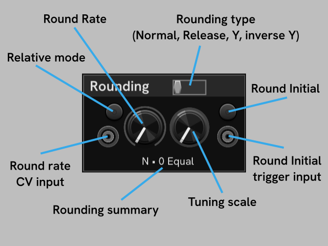

# Module HC-2

HC-2 is a companion to HC-1, offering control of Rounding (including tuning/scale quantization), the Compressor, Tilt EQ, and a live map of MIDI channel 1 and MIDI channel 16 control codes.

## Rounding

The **Rounding** section is controls for rounding (quantization).

Click the switch in the **Rounding** section title to select the rounding type: **Normal**, **Release**, **Y**, and **inverse Y**.
You can right click the switch to select the rounding type from a menu.

The left knob is the **Round rate**, from none, to slow, to very fast. The Round rate can be CV-controlled, in absolute and relative mode, just like the main HC-1 knobs.

The right **Tuning** knob is a selector for the tuning scale, defaulting to the common Western 12-tone equal (12TET) scale.
You can twist the knob to select different scales to round to, or you can right click the knob to select the tuning scale from a menu.

The top right button is to turn **Round initial** on and off.
Below the **Round initial** toggle button is the **Round initial trigger input** for automation.

## Compressor

The **Compressor** section provides automatable knobs for the Compressor controls, which are the same as in the Haken Editor.
See the Continuum User Guide for details on the Compressor.

## Tilt EQ

Controls for the EM Tilt EQ feature. See the Continuum User Guide for more details.

Each knob has a CV input and relative button, the same as the knobs on HC-1.

- The **Tilt** is flat at 64.

- The **Frequency** knob range is from 120hz for 0%, to 15kHz at 100%.

- The **Mix** knob range is from completely dry at 0% to wet at 100%.

## CC Maps

At the bottom of the module are two live maps of the MIDI control code (cc) traffic.
The upper map is for Channel 1 (master channel) and the lower one for Channel 16 (EM control).
The maps are cleared at the start of loading a new preset.

The height of each bar relects the last received value of a particular CC.
Hover over the CC maps to see the cc, purpose, and current value of MIDI control codes with nonzero values.
Values of 127 are in red, and values of 64 are in green.
Everything else is light gray.

CC maps may not survive to release.
They have proven to be useful to the developer during the development of this plugin, which involves a fair amount of poking and prodding the device to discover how things works.
It's also a bit of eye candy, so why not, if we don't need the space for something more important?
