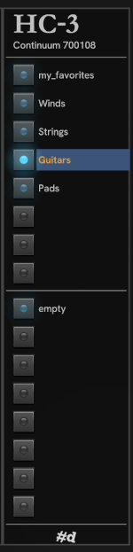

# Module HC-3

HC-3 is a companion for HC-1, offering easy access for up to 16 HC-1 favorites files.
If you want access to more than 16, just add another instance of HC-3.

HC-3 is initially blank when added to a ptach. Right click a button to choose an existing favorites file for that button, or drag and drop a favorites file onto the button.
If a Favorites file is currently open in HC-1, you can choose **Use _file_** to attach it to the button.
If you don't have any favorites files yet, you can create one by saving from the HC-1 **Favorite** tab menu.

Once there's a file associated with the button, clicking it will load that file into the **Favorite** tab in the associated HC-1 and the LED on the button lights up.
Click again and the file is forgotton in HC-1 and the light goes off. The favorites remain listed in HC-1.

Any favorites file open in HC-1 is automatically updated as you change the favorites in the **Favorite** tab (Add, Remove, Sort, Clear, ...). There is no undo.

Once you've configured HC-3, I recommend saving your work as a Preset using the module Preset menu (just like loading and saving configuration of any Rack module).
This allows you to use the same set of favorites files in other Rack patches by selecting that preset.

If you use a favorites file from one EM device on another EM device, you'll only get the favorites that have the same name on both devices, and the file will be changed to reflect the common set.
Similarly, if the favorites file contains user presets that are no longer on the device, they are silently removed.

