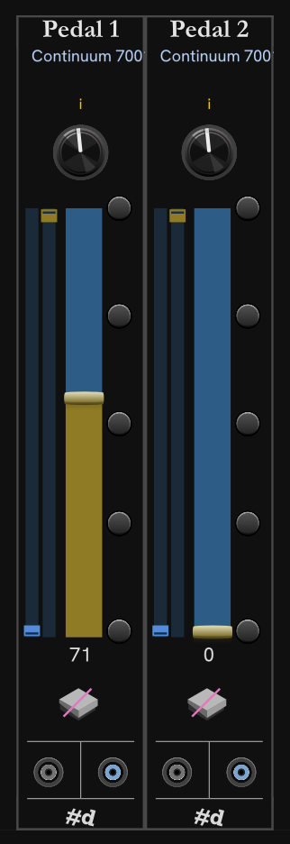

# Modules Pedal 1 and Pedal 2

The Pedal 1 & 2 modules provide for pedal control, virtual pedals, and CV in/out.

From top to bottom, left to right:

- The current EM device name is shown below the title.

- The knob controls the function assigned to the pedal. Click the knob to advance to the next item. Ctrl+click (Cmd on Mac) to go to the previous item. Right click for direct access to the menu of pedal functions.

  Each pedal function is equivalent to a MIDI control code (CC).

- On the left are sliders to set the minimum and maximum values for the pedal.

- The slider is a virtual pedal. Drag the handle or click anywhere on the bar to change the pedal value.
  Like all Rack knobs and sliders, hold Ctrl (fine) or Shift (coarse) while dragging to change the speed.
  When the mouse cursor is over the slider, you can roll the mouse wheel to change the value. Hold Shift, then roll to scroll faster.

  You can also use the keyboard to change values when the mouse cursor is over the slider:

  | Key | Plain | +Shift |
  | -- | -- | -- |
  | Home | Maximum value (127) | n/a |
  | End | Minimum value (0) | n/a |
  | Page Up | +10  | +10  |
  | Page Down | -10  | -10  |
  | Up | +1 | +10 |
  | Down | -1 | -10 |

  The digit keys `1234567890` act as a rough physical slider from minimum to maximum in even increments.
  When the range is 0-127, pressing **1** (leftmost key) goes to zero, and pressing **0** (rightmost key) goes to 127.

- To the right of the slider are buttons that jump directly to the propertional value. The top button sets the max value, and the bottom the minimum. The middle sets the middle value (64 with full 0-127 range).

- The current value of the pedal is shown under the slider.

- Below the value is an image of the type of pedal that has been detected by the device (if any).
  Hover over the image for a text description of the detected pedal.
  Some makes or models of pedals may not be accurately detected, and you may need to interact with the pedal before it is identified by the EM.

- At the bottom are CV input and output ports. CV are Unipolar 0v to 10v values. CV input sends the corresponding pedal value to the device. CV output is driven by the physical or virtual pedal, so you can easily connect a pedal to any module in the patch.

---

**Slugs** `pachde-hc-pedal-1`, `pachde-hc-pedal-2`

