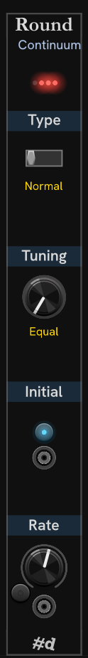

# Module Round

Controls for rounding (quantization).

At the top of the module are lights that display the same information as the LEDs on the lower right corner of the display on Continuum and ContinuuMini.

Click the switch in the **Type** section title to select the rounding type: **Normal**, **Release**, **Y**, and **inverse Y**.
You can right click the switch to select the rounding type from a menu.

The **Tuning** knob is a selector for the tuning scale, defaulting to the common Western 12-tone equal (12TET) scale.
You can twist the knob to select different scales to round to, or you can right click the knob to select the tuning scale from a menu.

The **Initial** button toggles initial rounding on and off.
Below the button is the **Round initial trigger input** for automation.

The **Rate** knob controls the rounding rate from none, to slow, to very fast.
The Round rate can be CV-controlled, in absolute and relative mode, just like the main HC-1 knobs.

---

**Slug** `pachde-hc-round`

// Copyright © Paul Chase Dempsey\

