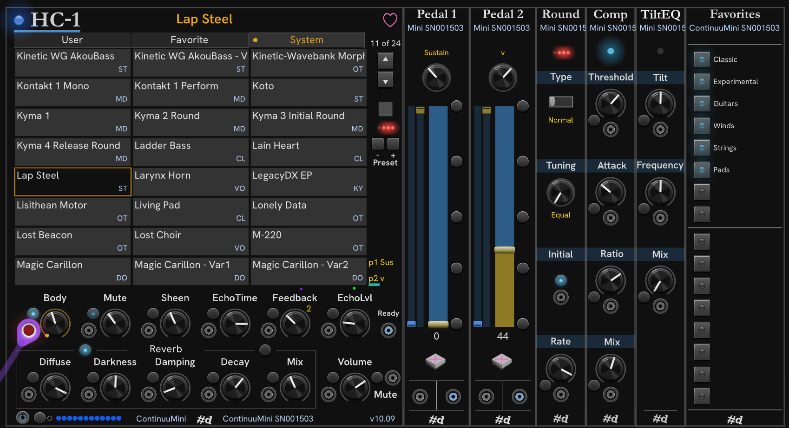

# pachde (#d) HC One

**HC One** is a performance-oriented plugin for Haken Audio's Eagan Matrix.
The Eagan Matrix is the synth engine for a variety of hardware devices.
These include the Haken Continuum, ContinuuMini, EaganMatrix Module, and the Osmose from Expressive E.

**Note** — Osmose has known issues when interfacing with external software.
External changes are not immediately displayed on it's screens.
Pachde does not own an Osmose or EMM, so any help testing and documenting any issues with these devices is welcome.

HC One is *not* intended to be a replacement for the Haken Editor.
The intention is to build out a performance companion for the device.

HC-1 is the main module.
The rest are companion modules to HC-1, and require an HC-1 in the patch to do anything.
HC One modules automatically find each other, so you are free to arrange them wherever in the rack you like.
They do not have to be side-by-side like Rack expander modules.

The HC-One modules shown here from left to right are:

- **[HC-1](HC-1.md)** Fast access to favorite presets, with knobs and CV inputs for the essential controls: Macros and the Recirculator.

- **[Pedal 1 & Pedal 2](Pedals.md#modules-pedal-1-and-pedal-2)** Pedal control, virtual pedals, and pedal CV in/out.

- **[Round](Round.md#module-round)** Control of rounding and the tuning scale, with CV and trigger.

- **[Compress](Compress.md#module-compress)** EaganMatrix compressor controls, with CV.

- **[Favorites](Favorites.md#module-favorites)** Pushbuttons to access up to 16 Favorite files.

- **[HC-2](HC-2.md#module-hc-2)** TiltEQ, and CC maps (To Be Retired).

---

